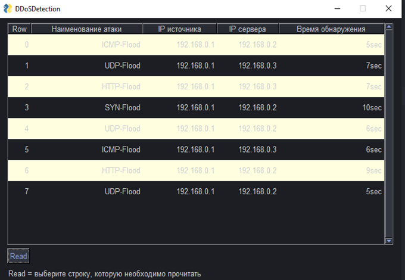

Система обнаружения DoS и DDoS атак на информационную инфраструктуру компании
Студент: Бережнёв Данил, ВКБ63.

Используемые библиотеки:
pandas
scikits learn
mininet
openflow
ryu controller
pysimplegui

Анализ трафика происходит с помощью рекуррентной нейронной сети.
Алгоритм обучения: случайный лес.

Интерфейс программы:

 

